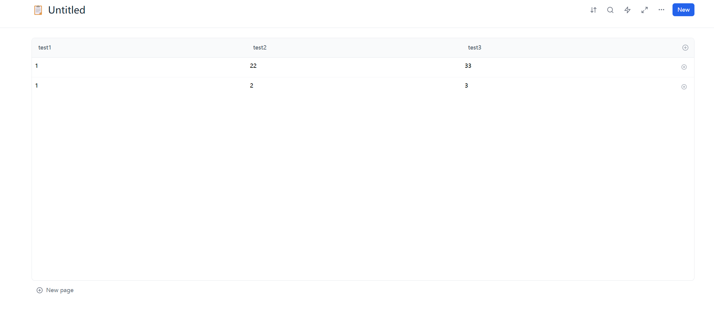

## 如何编译运行本项目

1.  确保你已经安装了 Node.js 和 npm。
2.  在项目根目录下，运行 `npm install` 安装依赖。
3.  运行 `npm run dev` 启动开发服务器。
4.  在浏览器中访问 `http://localhost:5173` 查看应用。

## 项目介绍

本项目是一个用于知识管理的数据库应用，旨在适配各种格式的属性。

### 已开发功能

-   支持 markdown, code, latex, number 等多种格式的属性。
-   支持从 SQLite 文件导入数据。
-   支持表格数据的增删改查。

### 待开发功能

-   更多数据类型的支持。
-   更强大的数据查询和过滤功能。
-   用户认证和权限管理。

## 程序截图

